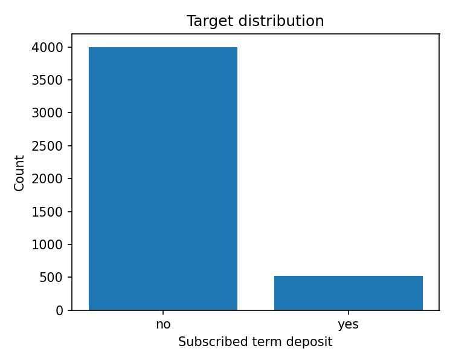
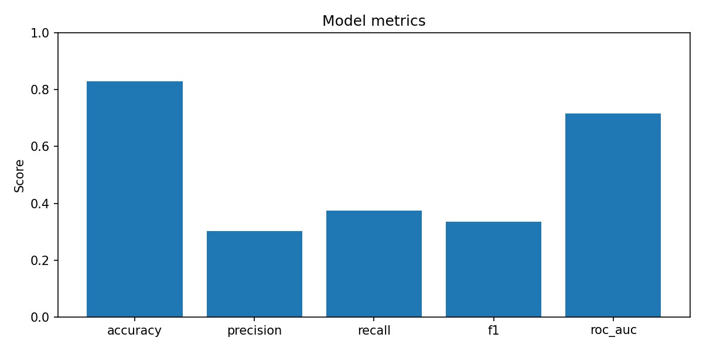
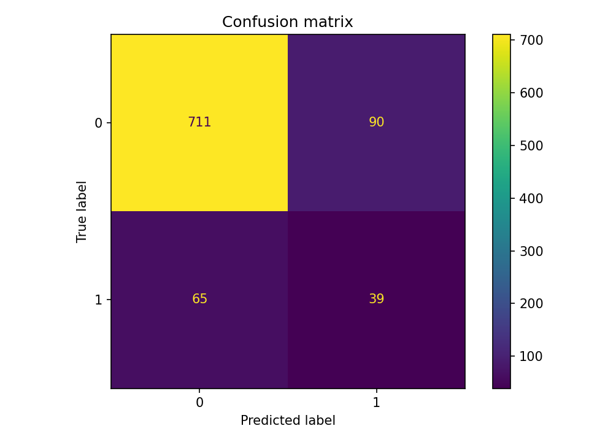
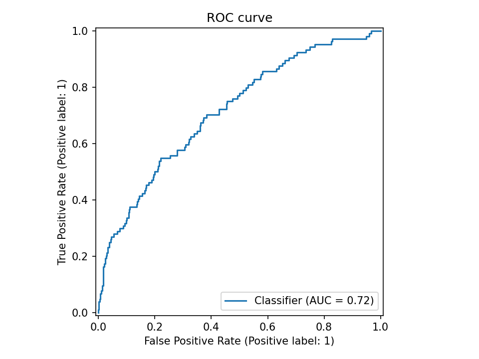

# Автоматизация ML-пайплайна на датасете Bank Marketing

> **Дисциплина:** "Автоматизация машинного обучения" 
> **Преподаватель:** Елена Смысловских  
> **Студент:** Лямцев Иван Алексеевич   
> **Формат проекта:** индивидуальная работа  
> **Тема проекта:** автоматизация ML-пайплайна для прогнозирования отклика клиента на банковское предложение

---

## 1. Описание бизнес-задачи

Цель проекта - построить и автоматизировать ML-пайплайн, который прогнозирует, подпишется ли клиент банка на срочный депозит после маркетингового контакта.

Бизнес-смысл задачи: банк проводит кампании обзвона клиентов. Если заранее определить клиентов с высокой вероятностью положительного отклика, можно:

- повысить эффективность маркетинговой кампании;
- снизить затраты на нецелевые звонки;
- приоритизировать клиентов для менеджеров;
- улучшить конверсию в оформление срочного депозита.

Тип задачи машинного обучения: **бинарная классификация**.

Целевой признак: `y`.

- `yes` - клиент подписался на срочный депозит;
- `no` - клиент не подписался.

---

## 2. Датасет

В проекте используется открытый датасет **Bank Marketing** из **UCI Machine Learning Repository**.

Источник датасета:  
https://archive.ics.uci.edu/dataset/222/bank+marketing

Датасет содержит данные прямых маркетинговых кампаний португальского банковского учреждения. Кампании проводились с помощью телефонных звонков. Задача датасета - предсказать, подпишется ли клиент на срочный депозит.

Характеристики датасета:

- **предметная область:** бизнес;
- **тип задачи:** классификация;
- **тип данных:** табличные данные;
- **признаки:** категориальные и числовые;
- **целевой признак:** `y`;
- **пропущенные значения:** отсутствуют.

В проекте используется файл `bank.csv`, то есть уменьшенная версия датасета, удобная для быстрого тестирования автоматизированного ML-пайплайна.

---

## 3. Используемые признаки

Примеры признаков:

| Признак | Описание |
|---|---|
| `age` | возраст клиента |
| `job` | тип занятости |
| `marital` | семейное положение |
| `education` | уровень образования |
| `default` | наличие кредитного дефолта |
| `balance` | средний годовой баланс |
| `housing` | наличие ипотечного кредита |
| `loan` | наличие персонального кредита |
| `contact` | тип коммуникации |
| `campaign` | количество контактов в рамках кампании |
| `pdays` | количество дней после предыдущего контакта |
| `previous` | количество прошлых контактов |
| `poutcome` | результат предыдущей кампании |

Признак `duration` исключается из обучения, потому что он описывает длительность текущего звонка. В реальном бизнес-сценарии до звонка это значение неизвестно, поэтому его использование может привести к утечке данных.

---

## 4. Архитектура ML-пайплайна

Общая схема пайплайна:

```text
UCI Dataset
    ↓
Download / Extract
    ↓
ETL
    ↓
Train / Validation / Test split
    ↓
Preprocessing
    ├── StandardScaler для числовых признаков
    └── OneHotEncoder для категориальных признаков
    ↓
AutoML через Optuna
    ├── выбор модели
    └── подбор гиперпараметров
    ↓
Обучение лучшей модели
    ↓
Оценка качества
    ↓
Сохранение модели, метрик, графиков и MLflow-логов
```

---

## 5. ETL

ETL реализован в файле:

```text
src/etl.py
```

### Extract

Загрузка датасета выполняется из **UCI Machine Learning Repository** через файл:

```text
src/download_data.py
```

Команда:

```bash
python -m src.download_data
```

### Transform

На этапе обработки данных выполняется:

- удаление дублей;
- нормализация текстовых значений;
- обработка потенциальных пропусков;
- преобразование целевого признака `y` из `yes/no` в `1/0`;
- удаление признака `duration` для предотвращения утечки данных.

### Load

Подготовленные данные передаются в ML-пайплайн для обучения и оценки модели.

---

## 6. AutoML / автоматизация обучения

Автоматизация ML-модели реализована через библиотеку **Optuna**.

Optuna автоматически перебирает:

- тип модели;
- набор гиперпараметров;
- параметры регуляризации;
- глубину деревьев;
- количество деревьев;
- минимальные ограничения на разбиения в деревьях.

В проекте сравниваются следующие модели:

- `LogisticRegression`;
- `RandomForestClassifier`;
- `ExtraTreesClassifier`.

Основная метрика для оптимизации:

```text
F1-score
```

Причина выбора F1-score: в задаче есть дисбаланс классов, поэтому одной accuracy недостаточно. F1-score учитывает и precision, и recall.

Файл обучения:

```text
src/train.py
```

Запуск обучения:

```bash
python -m src.train
```

---

## 7. Метрики модели

Для оценки качества используются:

- Accuracy;
- Precision;
- Recall;
- F1-score;
- ROC-AUC;
- Confusion Matrix;
- ROC Curve.

После обучения метрики сохраняются в файл:

```text
reports/metrics.json
```

Результаты Optuna сохраняются в файл:

```text
reports/tables/optuna_trials.csv
```

Лучшая модель по результатам AutoML: `ExtraTreesClassifier`.

Лучшие параметры:

```text
n_estimators = 94
max_depth = 17
min_samples_split = 7
min_samples_leaf = 1
```

---

## 8. Визуализации

После запуска обучения создаются графики:

```text
reports/figures/target_distribution.png
reports/figures/confusion_matrix.png
reports/figures/roc_curve.png
reports/figures/metrics.png
```






Модель показала ROC-AUC = 0.72, что означает умеренную способность модели отделять клиентов, склонных к подписке на депозит, от клиентов, которые не подпишутся.

Accuracy = 0.83, однако из-за дисбаланса классов эта метрика не является основной. Целевой класс "yes" встречается значительно реже, поэтому дополнительно анализируются precision, recall и F1-score.

Precision = 0.30, recall = 0.38, F1-score = 0.33. Это показывает, что модель находит часть клиентов, склонных к подписке, но качество можно улучшать за счёт балансировки классов, расширения признаков, увеличения числа итераций AutoML и подбора порога классификации.

---

## 9. MLflow

Для логирования экспериментов используется **MLflow**.

Логируются:

- лучшие гиперпараметры;
- accuracy;
- precision;
- recall;
- F1-score;
- ROC-AUC;
- обученная модель;
- графики.

Запуск MLflow UI:

```bash
mlflow ui
```

После запуска интерфейс будет доступен по адресу:

```text
http://127.0.0.1:5000
```

---

## 10. Тестирование

Тесты реализованы с помощью `pytest`.

Файлы тестов:

```text
tests/test_etl.py
tests/test_train.py
```

Проверяется:

- очистка данных;
- удаление дублей;
- нормализация текстовых значений;
- преобразование целевого признака;
- исключение признака `duration`;
- корректное разделение на train/test;
- работа preprocessing-пайплайна;
- корректный расчёт метрик.

Запуск тестов:

```bash
pytest
```

---

## 11. Docker

Для воспроизводимого запуска проекта используется Docker.

Сборка контейнера:

```bash
docker compose build
```

Запуск пайплайна:

```bash
docker compose up
```

Контейнер выполняет команду:

```bash
python -m src.train
```

Docker сохраняет результаты в локальные директории:

```text
models/
reports/
mlruns/
```

---

## 12. CI/CD

CI/CD реализован через GitHub Actions.

Файл workflow:

```text
.github/workflows/ci.yml
```

При каждом push или pull request выполняются:

1. загрузка репозитория;
2. установка Python 3.11;
3. установка зависимостей;
4. запуск тестов `pytest`;
5. сборка Docker-образа.

Это демонстрирует непрерывную интеграцию и проверку проекта при изменениях в репозитории.

---

## 13. Мониторинг

Мониторинг реализован на двух уровнях.

### Мониторинг качества модели

Используются:

- F1-score;
- ROC-AUC;
- Precision;
- Recall;
- Confusion Matrix;
- распределение целевого класса.

Это позволяет контролировать качество ML-модели и понимать, насколько хорошо она определяет клиентов с вероятностью подписки на депозит.

### Мониторинг инфраструктуры

Файл:

```text
src/monitor.py
```

Скрипт собирает:

- загрузку CPU;
- использование RAM.

Запуск:

```bash
python -m src.monitor
```

Результат сохраняется в файл:

```text
reports/tables/resource_monitoring.csv
```

---

## 14. Запуск проекта локально

### 1. Создать виртуальное окружение

```bash
python -m venv .venv
```

Windows:

```bash
.venv\Scripts\activate
```

Linux/macOS:

```bash
source .venv/bin/activate
```

### 2. Установить зависимости

```bash
pip install -r requirements.txt
```

### 3. Скачать датасет

```bash
python -m src.download_data
```

### 4. Запустить обучение

```bash
python -m src.train
```

### 5. Запустить тесты

```bash
pytest
```

### 6. Запустить мониторинг ресурсов

```bash
python -m src.monitor
```

### 7. Запустить MLflow UI

```bash
mlflow ui
```

---

## 15. Структура проекта

```text
.
├── .github/
│   └── workflows/
│       └── ci.yml
├── data/
│   ├── raw/
│   └── processed/
├── docs/
│   ├── presentation_outline.md
│   └── teacher_note.md
├── models/
├── reports/
│   ├── figures/
│   └── tables/
├── src/
│   ├── __init__.py
│   ├── config.py
│   ├── download_data.py
│   ├── etl.py
│   ├── evaluate.py
│   ├── monitor.py
│   ├── predict.py
│   └── train.py
├── tests/
│   ├── test_etl.py
│   └── test_train.py
├── Dockerfile
├── docker-compose.yml
├── Makefile
├── README.md
└── requirements.txt
```

---

## 16. Выводы для бизнеса

Разработанный ML-пайплайн позволяет автоматизировать процесс обучения модели для прогнозирования отклика клиента на банковское предложение.

Практическая польза для бизнеса:

- можно заранее выделять клиентов с высокой вероятностью подписки на депозит;
- можно снижать нагрузку на операторов;
- можно уменьшать количество неэффективных звонков;
- можно повышать конверсию маркетинговой кампании;
- можно регулярно переобучать модель при появлении новых данных.